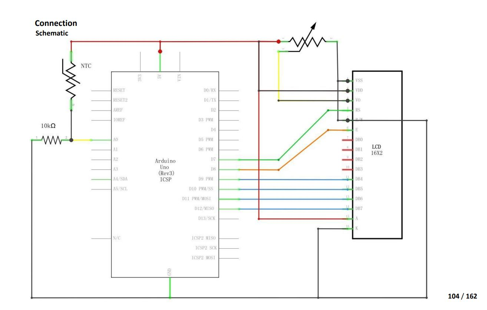

# Time Series Temperature Data from Arudino

This project is for the Arudino IoT section of the course [CNIT 133I - Javascript for IoT and XR](https://www.coursicle.com/ccsf/courses/CNIT/133I/) taught by [Professor Claudia da Silva](https://cdasilva.info/) at [CCSF](https://www.ccsf.edu/).  An [Arduino Uno](https://www.amazon.com/gp/product/B01D8KOZF4/ref=ppx_yo_dt_b_asin_title_o06_s00?ie=UTF8&psc=1) is used to read temperature sensor data from a thermistor and displayed on an LCD.  The data is also send to a backend Node server through the serial port (COM7 on my Windows 10 PC).

The Node server uses the [Serialport](https://serialport.io/) library to read from the Arduino board and uses Socket.io(https://socket.io/) to send the data to the React frontend.  The React frontend uses [socket.io-client](https://socket.io/docs/v4/client-api/) to read the data and displays it.  It also shows the past data in a chart as it comes in.  There's a switch button to switch between celsius and fahrenheit that communicates with a Node [Express](https://expressjs.com/) backend through a Rest API POST request.

Typescript is used on both the Node server and the React frontend.<br/>

---
## Presentation and Demo

<a href="https://youtu.be/G0ZM8t943lU" target="_BLANK"></a>

---
## Project Block Diagram

<br/>

---
## Project Folder Structure
```
├── README.md # This file.
├── .gitignore # Git untracked files.
├── images
│   └── TimeSeriesArduinoProjectBlockDiagram.jpg # Project block diagram.
├── timeseries-arduino
│   └── timeseries-arduino.ino - C source code to upload to Audino Uno
├── backend
│   ├── package.json # npm package manager configuration file for Node backend
│   ├── tsconfig.json # Typescript configuration file for Node backend
│   └── src
│       └──  index.ts # Node server using Socket.io and Express.
└── frontend
    ├── package.json # npm package manager configuration file for React frontend.
    ├── tsconfig.json # Typescript configuration file for React frontend
    └── public
        ├── index.html # Generated by create-react-app - not modified.
        ├── manifest.json # Generated by create-react-app - not modified.
        ├── logo192.png # Generated by create-react-app - not modified.
        ├── logo512.png # Generated by create-react-app - not modified.
        ├── robots.txt # Generated by create-react-app - not modified.
        ├── favicon.ico  # Generated by create-react-app - not modified.
        └── src
            ├── index.tsx # This is the root of the app.
            ├── index.css # Styling for the app.
            ├── App.tsx # Main app.
            ├── components
            │   ├── ShowTemp.tsx # Displays the temperature.
            │   ├── TempSwitch.tsx # Switch that switches between Celsius and Fahrenheit
            │   └── TimeSeriesChart.tsx # Displays time series chart of temperature data as it comes in.
            ├── contexts
            │   ├── AppContext.tsx # React Context API to manage state for the app.
            │   └── appReducer.tsx # Reducer for the state management of the app.
            ├── types
            │   └── Types.ts - Typescript type definitions. Not all here. Some are currently in the components.
            └── utils
                └── helpers.ts - Helper function that returns the temperature in °C & °F given the temperature in Kevin.
```
---
## Arduino Uno

Source: Elegoo Super Starter Kit for UNO V1.0.2019.09.17.pdf (Lesson 15 pages 103-107)




<br/>

---

## Installation Instructions

To run the app in the development mode, clone this repository, connect the Arduino Uno board to the serial port, then using the Arduino IDE, open the file timeseries-arduino/timeseries-arduino.ino, verify and upload to the board.

For the backend Node server, cd in to the backend folder and run
```
npm install
```
then run
```
npm start
```
then for the frontend React app, in another terminal cd in to frontend and run
```
npm install
```
then run
```
npm start
```

Open [http://localhost:3000](http://localhost:3000) to view it in your browser.<br/>

---

## Resources

How to use a low pass filter with an RC circult so that instead of using a potentiometer to control the LCD contrast, it can be software programmable.<br/>
[https://www.instructables.com/1602-LCD-Contrast-Control-From-Arduino/](https://www.instructables.com/1602-LCD-Contrast-Control-From-Arduino/)<br/>

Printing Unicode characters on LCD.  I used this to display the degree ° symbol.<br/>
[https://forum.arduino.cc/t/print-degree-symbol-on-lcd/19073](https://forum.arduino.cc/t/print-degree-symbol-on-lcd/19073)<br/>

React Typescript Tutorial by Codevolution, in particular the useContext and useReducer (videos 12-15).<br/>
[https://www.youtube.com/watch?v=TiSGujM22OI&list=PLC3y8-rFHvwi1AXijGTKM0BKtHzVC-LSK](https://www.youtube.com/watch?v=TiSGujM22OI&list=PLC3y8-rFHvwi1AXijGTKM0BKtHzVC-LSK)<br/>


